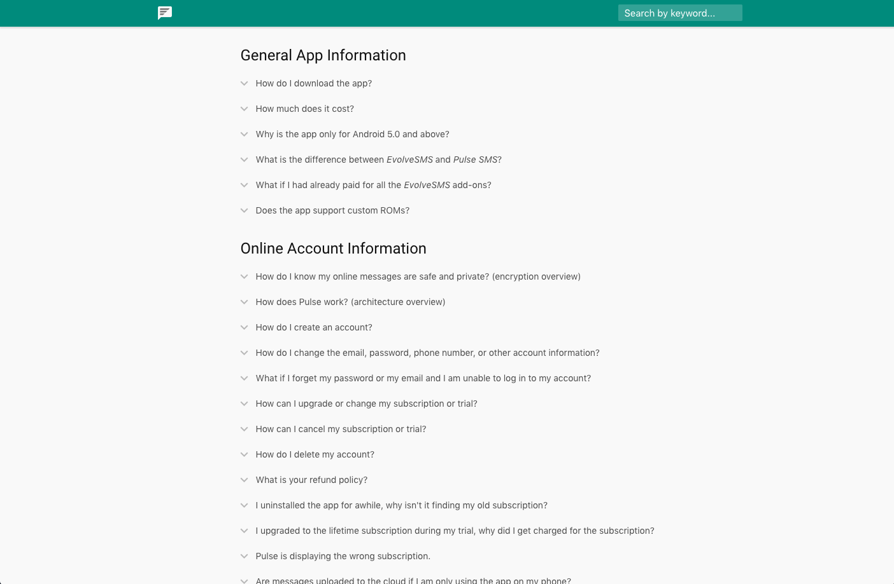

# Help Site Template

I have found that a decent (and extensive!) help page is beyond helpful for the user and indispensable for a solo developer, such as myself. I used to get overwhelmed with several hundred emails a day. Since making this help page, support requests have gone down **considerably**, as my apps have only continued to grow. Up front, an extensive help site is a huge time commitment. In the long run, though, this has paid off for me, ten-fold.

This help page template is a very simple static site. It will work well hosted on GitHub pages. It isn't anything fancy, but it stores your topics, let's your users search for those topics based on keywords, and even auto-completes the keywords. This little help page project is a direct fork of the one I use for [Pulse SMS](https://messenger.klinkerapps.com/help).

### Adding your own content

The first thing you will probably want to do is add your own content to the page. The content of the FAQ is just stored in a JSON array. You can find this array in the [topics.js](help/resources/js/topics.js) file.

The array is an array of categories. Within each category is an array of topics. Each topic has a title, a set of keywords, and the description. I highly recommend spending time on the keywords section, as well as the displayed content. The keywords are the items that are searchable through the search bar. They will also be auto-completed as the user types them.

```javascript
[{
  title: "Help Category One",
  items: [{
    keywords: "test help category one first topic",
    title: "Here is topic #1",
    text: "Your expanded text goes here. You can add any HTML formatting that you want." + brbr() +
      "There are some helpers for " + link("links", "https://messenger.klinkerapps.com")
  }, {
    keywords: "test help category two second topic",
    title: "Here is topic #2",
    text: "I could continue making more topics, but don't really need to. You get the picture."
  }]
}, {
  title: "Help Category Two",
  items: [{
    keywords: "test help category three third topic",
    title: "Here is topic #3",
    text: "Just another expandable topic here. Make as many as you want."
  }]
}, {
  title: "Help Category Three",
  items: [{
    keywords: "test help category four forth topic",
    title: "Here is topic #4",
    text: "Ok, last example."
  }]
}]
```

### Customizing the look

The main thing that you will want to customize is probably the toolbar color and the icon.

* You can add your own icon by changing out the [logo.svg](help/resources/images/logo.svg) file.
* You can customize the toolbar color (and the link color), from the [theme.css](help/resources/css/theme.css) file.

The next thing that you may consider coloring is the highlight color. Whenever the user searches for a keyword that appears in the topics title, that word is highlighted in the title. You can customize this from the top of the [theme.css](help/resources/css/theme.css) file, as well.

After that, take a look at the top element in the [expandable.css](help/resources/css/expandable.css) file. It will allow you to set the color of the topic title, when it is expanded.

The last thing you may want to customize is the color of the background when you hover over an auto-complete result, when searching. You can customize this color from the top line, in the [autocomplete.js](help/resources/js/autocomplete.js) file.

## Contributing

Please fork this repository and contribute back using [pull requests](https://github.com/klinker24/help-site-templage/pulls). To open up a new issue, please open it within this repository.

## License

    Copyright 2018 Luke Klinker

    Licensed under the Apache License, Version 2.0 (the "License");
    you may not use this file except in compliance with the License.
    You may obtain a copy of the License at

       http://www.apache.org/licenses/LICENSE-2.0

    Unless required by applicable law or agreed to in writing, software
    distributed under the License is distributed on an "AS IS" BASIS,
    WITHOUT WARRANTIES OR CONDITIONS OF ANY KIND, either express or implied.
    See the License for the specific language governing permissions and
    limitations under the License.
